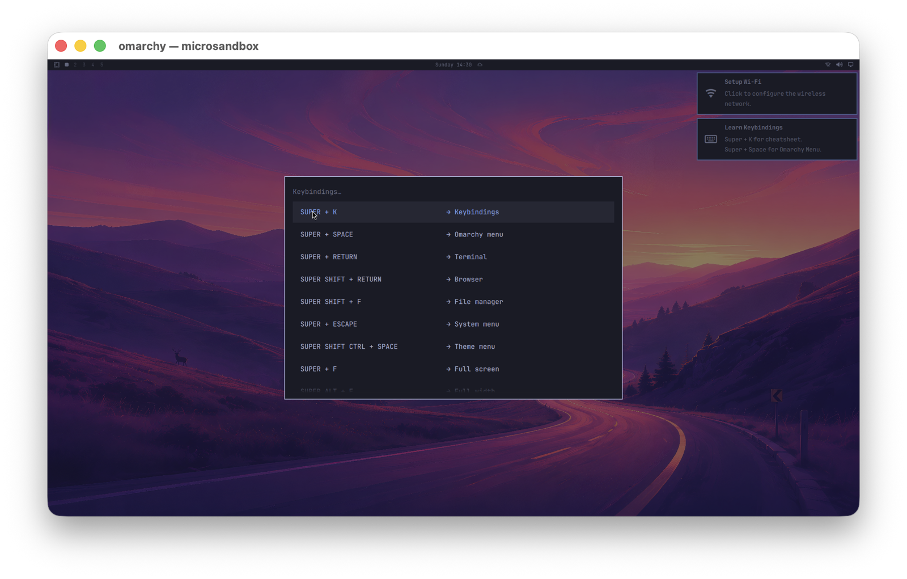

# msb-omarchy

Run the [Omarchy](https://omarchy.org) desktop — Hyprland + the Quattro Quickshell shell — inside a [microsandbox](https://github.com/superradcompany/microsandbox) microVM on an Apple Silicon Mac, with graphics.

> Status: **M2 works** (2026-08-30) — the Omarchy Quattro desktop runs inside a microsandbox microVM on Apple Silicon, shows up in a native macOS window via `msb display`, and takes keyboard and pointer input. See [docs/plan.md](docs/plan.md) for the milestones and [docs/assessment.md](docs/assessment.md) for the evidence behind them.



*`msb run --display`: the Omarchy desktop in a native macOS window, with the keybindings cheatsheet opened from the Mac keyboard (Super+K). Over VNC instead: [docs/images/m1-omarchy-desktop.png](docs/images/m1-omarchy-desktop.png).*

This is the opposite direction from [omarchy-microsandbox](https://github.com/ya-luotao/omarchy-microsandbox), which is an Omarchy bar plugin for managing microsandbox VMs. This repo puts Omarchy *inside* the VM.

## Quick start

Needs an Apple Silicon Mac, Docker (arm64 images), and an `msb` built from the [`gpu-m3` branch of microsandbox](https://github.com/ya-luotao/microsandbox/tree/gpu-m3) — the virtio-gpu display, `msb display`, clipboard, virtio-snd audio and the small `msb_krun` fixes live there while the upstream PRs are open (`gpu-m0` is the display-only subset that microsandbox #1482 tracks) (libkrun [#116](https://github.com/superradcompany/libkrun/pull/116), [#117](https://github.com/superradcompany/libkrun/pull/117), [#118](https://github.com/superradcompany/libkrun/pull/118); microsandbox [#1482](https://github.com/superradcompany/microsandbox/pull/1482)). Either build it (recipe in [docs/plan.md](docs/plan.md), M0) or take the fork's prebuilt binary from [release v0.6.16-gpu-m3.1](https://github.com/ya-luotao/microsandbox/releases/tag/v0.6.16-gpu-m3.1); both need `brew install slp/krun/virglrenderer`. `bin/build-rootfs` clones the Omarchy sources it needs and builds the image the omarchy-pkgs PKGBUILD pins (4.0.2 today).

```sh
bin/build-rootfs      # Docker image from Arch Linux ARM + the omarchy packages, loaded into msb
bin/run -d --display  # msb run --init auto … -p 127.0.0.1:5901:5900 --display: native window with keyboard and pointer
msb display omarchy   # reopen the window later
open vnc://127.0.0.1:5901   # or VNC
bin/display-shot omarchy shot.png --key super+k   # headless: press keys, grab the scanout as PNG
```

`bin/run` sets `MSB_SND=1`, so the guest has a virtio-snd card and PipeWire plays through the Mac's default output. The guest's wayvnc listens without authentication on its own port 5900; `bin/run` publishes it on the Mac's loopback only (`127.0.0.1:5901`), so it is reachable by other users of the same Mac and nobody else.

Text copied in the desktop lands on the Mac pasteboard and vice versa while the `msb display` window is open; `MSB_DISPLAY_CLIPBOARD=0 msb display omarchy` turns that off in both directions.

`msb exec omarchy -- journalctl -b` and `msb cp omarchy:/path …` work as usual while the desktop runs.

## Why

Nobody has shown a full Linux desktop running inside libkrun/microsandbox on a Mac. The closest existing routes to Omarchy-on-Mac go through Virtualization.framework (lume) or QEMU + HVF. A microVM that boots in seconds and opens a native window would be a new thing.

## Shape of the project

```
Mac (Apple Silicon)
└── msb run omarchy                      ← microsandbox, HVF backend
    ├── virtio-gpu (2D scanout) ──────── M1: wayvnc → -p 5900 → Screen Sharing
    │                                    M2: krun_display → native macOS window
    ├── virtio-input ──────────────────── M2: keyboard / pointer
    └── guest: Arch Linux ARM rootfs
        ├── systemd (msb --init auto), seatd/logind
        ├── Hyprland 0.56 on virtio-gpu KMS, llvmpipe (LIBGL_ALWAYS_SOFTWARE=1)
        └── Omarchy Quattro shell (quickshell), packages per omarchy-arm-utm
```

Two pieces live in other repos and will be contributed there:

- **microsandbox**: enable `msb_krun`'s existing `gpu` / `input` Cargo features in `crates/runtime` and add the host-side display plumbing. The guest kernel (libkrunfw 6.12, aarch64) already ships `CONFIG_DRM_VIRTIO_GPU=y`, `CONFIG_VIRTIO_INPUT=y`, `CONFIG_SND_VIRTIO=y`.
- **omarchy** (upstream): anything that turns out to be a genuine aarch64 or headless fix.

This repo holds the guest image build, the run scripts, the docs, and the findings.

## Milestones

| | Goal | Proof |
|---|---|---|
| M0 ✅ | `/dev/dri/card0` appears in a guest with `gpu` enabled | `modetest -M virtio_gpu -s 37@36:1920x1080` succeeds (KMS on, connector Virtual-1) |
| M1 ✅ | Omarchy desktop visible over VNC | `bin/run` + `vnc://127.0.0.1:5901` shows the Quattro bar |
| M2 ✅ | Native macOS window | `msb run --display` opens a window; Super+K opens the cheatsheet from the host keyboard |

## Hard constraints (read before designing around them)

- Hyprland cannot run with zero DRM devices: aquamarine's headless backend has no allocator (`drmFD() == -1`), so a virtio-gpu node is mandatory even for software rendering. Upstream issue [#7917](https://github.com/hyprwm/Hyprland/issues/7917) is closed as not planned.
- Software rendering over virtio-gpu KMS is the proven path (it is what Hyprland's own CI does). Venus/virgl acceleration on Apple Silicon is not proven; the plan does not depend on it.
- omarchy-pkgs publishes no aarch64 database; roughly 17 of 148 base packages must be built from source (per omarchy-arm-utm).
- The virtio-gpu cursor plane works on the host side (device, ABI and viewer), but Omarchy keeps its software cursor: Hyprland renders a frame per cursor move without VRR, so a hardware cursor is currently slower. See [docs/assessment.md](docs/assessment.md) and `guest/pkgbuilds/aquamarine/`.

## Related

- [ggalancs/omarchy-arm-utm](https://github.com/ggalancs/omarchy-arm-utm) — Omarchy Quattro on Arch Linux ARM under UTM; the package list and the software-rendering settings come from here
- [microsandbox docs: VNC desktop](https://docs.microsandbox.dev/examples/development/vnc-desktop) — the existing framebuffer + port-forward pattern M1 follows
- [libkrun display API](https://github.com/libkrun/libkrun) (1.15+) — reference for M2's host window

## License

MIT
