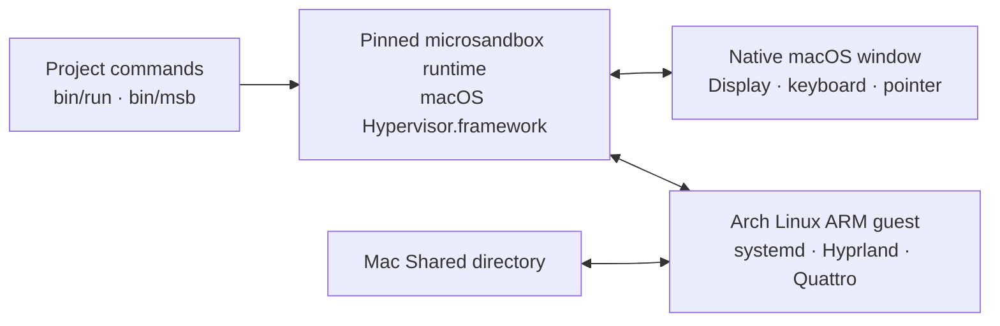

# msb-omarchy

**An unofficial testbed for display and GPU support in microsandbox on Apple Silicon.**

[microsandbox](https://github.com/superradcompany/microsandbox) runs Linux microVMs, but has no display path. This project carries one in a fork of its runtime: a 2D virtio-gpu scanout shown in a native macOS window, virtio-input, a text clipboard over vsock and virtio-snd through CoreAudio. The workload is a full [Omarchy](https://omarchy.org) desktop (Hyprland + Quattro), because a real compositor finds problems a test pattern does not. What the project finds, measures and fixes is recorded so that others, microsandbox's maintainers included, can reuse it.

**Where GPU support stands.** The guest renders with Mesa's llvmpipe on the CPU, and virtio-gpu carries finished frames to the host. Nothing is hardware-accelerated yet. Venus, which runs guest Vulkan on the Mac's GPU through MoltenVK, is the next experiment ([M7](docs/plan.md#m7--venus-on-hvf-graphics-not-only-compute)).

**Not affiliated.** This is an independent project. It is not affiliated with or endorsed by the microsandbox, libkrun, Omarchy or Hyprland projects.

[Findings](#findings) · [Quick start](#quick-start) · [Daily use](#daily-use) · [Configuration](#configuration) · [Validation](#validation) · [Architecture](#architecture)


*An actual guest screenshot: Foot with Pinyin input, Nautilus and the shared directory.*

## Findings

The [findings index](docs/findings.md) lists what this project has learned, by layer: host devices, guest kernel, Mesa and Hyprland, macOS and the microsandbox CLI. Each entry gives the cause, the fix or workaround, the evidence and the upstream status. Some that matter beyond this project:

- With `NO_VIRGL`, the virtio-gpu device rejects every 2D command on macOS, so the host never receives a frame; the fork adds a 2D-only mode (D1).
- Hyprland decides whether to wait for rendering from the DRM driver name, so on virtio-gpu it scans out half-drawn llvmpipe frames. A small `glFlush`→`glFinish` shim fixes it and keeps llvmpipe's threads (G2).
- A desktop VM can be paused and resumed in about 30 ms, but not checkpointed: virtio-gpu and virtio-snd cannot quiesce (D8).
- `msb` built locally against the macOS 27 SDK cannot take HVF checkpoints (M1).

**Upstream.** The display changes were proposed to microsandbox and msb_krun in August 2026 and withdrawn unreviewed on 2026-09-23: as one change they were too large to review and had fallen far behind. microsandbox's maintainers have GPU work in progress internally ([#291](https://github.com/superradcompany/microsandbox/issues/291)) and prefer small, separate pull requests. The fork is therefore kept here as a test vehicle rather than proposed as a whole; the findings that stand alone are the ones worth reporting upstream. See the [upstream status](docs/assessment.md#upstream-status).

## The workload: an Omarchy desktop

The desktop is a complete, persistent environment, usable day to day:

- **A persistent desktop.** Create a VM once, close and reopen its window, or stop and resume it with files and settings preserved.
- **Native Mac integration.** The graphics runtime provides a macOS display window, keyboard and pointer input, text clipboard synchronization and audio output.
- **A desktop tuned for software rendering.** Two display profiles, larger text, opaque windows and disabled window animations, blur and shadows. The compositor rasterizes on every vCPU and presents only finished frames.
- **Useful applications from the first boot.** Chromium, Nautilus, Foot, CJK fonts and Fcitx5 Pinyin, with working default browser and file-manager associations.
- **Explicit file sharing.** A writable Shared directory, accessible from the top bar and the file-manager sidebar.
- **An isolated runtime.** Checksummed runtime and firmware downloads, with project-local VM state independent of a global microsandbox installation.
- **Recorded validation.** Launcher and release tests, guest image checks, Mac smoke tests, screenshots and measurements tied to the tested image.

**Status:** experimental. The published guest image `msb-omarchy:4.0.2-2` passed both display-profile smoke tests and the frame check on a Mac on 2026-09-24, and new desktops use it by default. See [validation](#validation) and [current boundaries](#current-boundaries) for the scope of those results.

## Quick start

### Requirements

| Component | Requirement |
| --- | --- |
| Host | Apple Silicon Mac with Hypervisor.framework support |
| Tools | Git, Python 3.9+, Homebrew and the macOS `curl` / `codesign` commands |
| Image build (optional) | A running Docker engine capable of building `linux/arm64` images, only to build the guest image yourself |
| Host libraries | `slp/krun/virglrenderer`, `molten-vk` and `libepoxy` |
| Storage | Space for Docker layers, the runtime cache and each VM's writable disk |

Each VM defaults to **4 vCPUs, 4G RAM and a 16G writable disk**. The desktop runs through microsandbox and macOS virtualization; Docker is only needed to build the image yourself.

Keep the checkout at a short path: the runtime's socket paths must fit in 104 bytes, which limits the state directory (`<checkout>/.runtime/home` by default) to 51 bytes. `bin/run` reports a longer one; set `MSB_HOME` to a shorter directory, such as `~/.msb-omarchy`, before creating desktops.

### Install and launch

```sh
git clone https://github.com/ya-luotao/msb-omarchy.git
cd msb-omarchy

brew install slp/krun/virglrenderer molten-vk libepoxy

bin/setup          # Download and verify the pinned runtime and firmware
bin/doctor         # Check the selected runtime and host support
bin/run            # Create the desktop and open its native window
```

The first `bin/run` downloads the published guest image (about 6 GB). Afterward, use **`bin/run`** to return to the desktop. The launcher waits for the desktop shell to respond before opening the window.

To build the image yourself instead, run `bin/build-rootfs` before `bin/run` (see [building and publishing](#building-and-publishing)). A successfully checked and loaded image becomes this checkout's default for **new** VMs. Existing VMs retain their disk and settings.

## Daily use

| Action | Command or behavior |
| --- | --- |
| Create, resume or reopen the default desktop | `bin/run` |
| Start it without opening a window | `bin/run --no-display` |
| Close the window | The VM and its applications keep running |
| Pause the VM | `bin/pause` — applications stay open in memory and stop using CPU; `bin/run` resumes it in about 2 seconds |
| Stop the VM | `bin/stop` — files and settings remain; running applications close |
| Return after a Mac restart | `bin/run` — the VM's disk recovers like after a power loss; applications start fresh, paused ones included |
| List this project's VMs | `bin/msb list` |
| Capture the current desktop | `bin/screenshot omarchy desktop.png` |
| Check runtime and host support | `bin/doctor` |

Use **`bin/msb`** for low-level commands in this project. Plain `msb` addresses your separate global installation.

### Separate desktops

Give each desktop a name and each concurrently running VM a different forwarded VNC port:

```sh
VNC_PORT=5902 bin/run --name work --profile standard
bin/stop --name work
bin/run --name work
```

The VM keeps its original display profile, image, shared path and resource settings. Rebuilding the image prepares a new default; it does not migrate existing desktops.

Reset is a separate, explicit operation:

```sh
bin/reset --name work --yes
```

This deletes that VM's guest disk and launcher settings. Files in the host Shared directory remain available.

### Keyboard and first launch

The Mac **Command key (⌘)** maps to **Super** inside Omarchy.

| Shortcut | Action |
| --- | --- |
| ⌘ + Enter | Open a terminal |
| ⌘ + K | Browse keyboard shortcuts |
| ⌘ + Shift + Enter | Open the browser |
| ⌘ + Shift + F | Open the file manager |
| Ctrl + Space | Switch English / Chinese Pinyin input |

Click the top-left logo for the menu. The one-time welcome links to a Mac guide, also available through **Learn → Omarchy on Mac**. macOS shortcuts such as Spotlight can take precedence over guest shortcuts.

Chromium may ask you to create a keyring password on its first launch to protect saved browser credentials.

## Display profiles

| Profile | Output resolution | Desktop scale | Use |
| --- | --- | --- | --- |
| `light` — default | 1600 × 900 | 1.25 | Lower rendering cost for everyday interaction |
| `standard` | 1920 × 1080 | 1.25 | More workspace for multiple applications |

Profiles are selected when creating a VM. The light profile renders **30.6% fewer pixels**; UI scaling by itself does not reduce the output pixel count.

Both profiles use a larger shell font, a 12pt terminal font, opaque windows and a compact top bar with workspaces, time, shared files, tray and audio. Window animations, blur and shadows are disabled. The compositor loads a small `glFlush`→`glFinish` shim so software rendering keeps every vCPU without presenting partially drawn frames; `bin/frame-check` tests for such frames.

In the [recorded Mac test](docs/experience.md), create-to-ready took 5.07 seconds for light and 5.67 seconds for standard. Scanout frames per second measured with `bin/measure-display` on an M3 Pro, two runs each, before and after the compositor change:

| Profile | Pointer sweep at 60 Hz | Terminal redrawing its whole window |
| --- | --- | --- |
| `light` | 58 → 60 | 21–22 → 52–56 |
| `standard` | 43 → 60 | 15 → 41–42 |

These count frames the guest presents, not end-to-end latency, and are no guarantee for other machines; they were taken with the 0.6.16 runtime. Method and raw numbers are in the [assessment](docs/assessment.md#half-drawn-frames-revisited-2026-09-24-glfinish-instead-of-one-thread).

## Files, clipboard and audio

### Shared files

By default, `Shared/` in the project checkout is mounted at `~/Shared` inside the guest. The top-bar folder and file-manager bookmark open that location.

```sh
SHARED_DIR="$HOME/Projects/my-project" VNC_PORT=5903 bin/run --name project
```

The mount maps guest UID/GID 1000 so files can be read and written from either side. Only the selected directory is shared. Documents elsewhere in the guest home remain on that VM's disk.

Shared paths are saved when a VM is created. Keep the checkout and shared directory at stable paths; runtime state and shared mounts are not automatically relocated when the repository moves.

### Clipboard and sound

Text clipboard synchronization works while the native display window is open. To disable it for the viewer:

```sh
MSB_DISPLAY_CLIPBOARD=0 bin/run
```

Clipboard images are not supported. Audio uses the graphics runtime's virtio-snd and CoreAudio path to the Mac's output device.

### VNC

VNC is available at `vnc://127.0.0.1:5901` for the default desktop. The guest listener has no authentication; the launcher forwards it only to the Mac's loopback interface. Set `VNC_PORT` when creating another VM to avoid a port conflict.

## Architecture



The host runtime boots the guest using macOS virtualization. The guest renders through software OpenGL (llvmpipe) and virtio-gpu KMS; a preloaded library makes Hyprland wait for llvmpipe before each commit, because Hyprland only does so for GPUs it recognizes as software. The display server exposes scanout frames to the native viewer and sends input back to the guest. Clipboard and audio use the runtime's own integrations (vsock and virtio-snd through CoreAudio).

The image recipe adds this repository's applications and configuration to an immutable Omarchy 4.0.2 base. Before and after installing packages, it verifies that Hyprland, Aquamarine, Mesa, Quickshell and Qt base remain at their original versions.

`config/release.json` pins the base-image digest, graphics runtime checksum and matching firmware checksum. The runtime is the [gpu-m4 graphics build](https://github.com/ya-luotao/microsandbox/releases/tag/v0.7.2-gpu-m4.1) of microsandbox 0.7.2; a stock global microsandbox binary does not include its display command. Its changes are not in microsandbox or msb_krun: the upstream proposals were withdrawn unreviewed (see [Findings](#findings)), and the [upstream status](docs/assessment.md#upstream-status) records where each piece stands.

## Configuration

These settings apply when creating a VM. `--name` and `--profile` take precedence over their environment defaults.

| Variable | Default | Purpose |
| --- | --- | --- |
| `NAME` | `omarchy` | VM name |
| `PROFILE` | `light` | Display profile |
| `CPUS` | `4` | Virtual CPU count |
| `MEMORY` | `4G` | Guest memory |
| `ROOT_DISK` | `16G` | Writable guest disk capacity |
| `SHARED_DIR` | Checkout's `Shared/` | Directory shared with the guest |
| `VNC_PORT` | `5901` | Loopback VNC port on the Mac |
| `TAG` | Last successfully built and loaded image, otherwise the published image pinned in `config/release.json` | Image for a new VM; also overrides the build tag |
| `MSB_GPU_DISPLAY` | Profile resolution | Advanced output-size override, e.g. `1600x900` |

Advanced runtime overrides are `MSB` for the binary, `MSB_LIBKRUNFW_PATH` for firmware and `MSB_HOME` for state. The default state directory is `.runtime/home/`. The project explicitly selects its own configuration file, so global microsandbox configuration is not inherited.

### Changing runtimes

A newer runtime migrates the VM database the first time it opens it, and older runtimes refuse the migrated database. Before a different runtime first opens it, the launcher saves a copy under `.runtime/home/db-backups/`, and it refuses while VMs started by the previous runtime are still running or paused; stop them first. To go back, stop all VMs, delete `.runtime/home/db/msb.db-wal` and `msb.db-shm`, copy the saved database over `.runtime/home/db/msb.db` and check out the previous `config/release.json`. VM disks are not changed by the migration. Updating from the 0.6.16 runtime to 0.7.2 after pulling this version is such a migration.

## Validation

```sh
bin/check
bin/smoke --profile light
bin/smoke --profile standard
```

| Check | What it establishes |
| --- | --- |
| `bin/check` | Launcher persistence and failure handling, release gates, script syntax, JSON and whitespace checks |
| Image build checks | Required commands, application associations, fonts, generated theme, terminal configuration and shared libraries |
| `bin/smoke` | A real Mac VM boots, maps application windows (the terminal through Super+Enter's launcher), shares files in both directions and retains files after stop/start |
| `bin/frame-check TEST_VM` | Opening and closing the menu never presents a half-drawn frame |
| `bin/publish --check` | The current local image matches passing smoke reports for both profiles |

Smoke tests create independent VMs with their own shared directories and retain reports and screenshots under `test-runs/`. By default, successful test VMs are stopped and their disks are retained; `--keep` leaves them running for inspection.

The [2026-09-13 validation record](docs/experience.md) contains 16 passing local tests, both Mac smoke reports, image identity, screenshots and measurements; the 2026-09-24 rendering change and its checks are recorded in the [assessment](docs/assessment.md#half-drawn-frames-revisited-2026-09-24-glfinish-instead-of-one-thread). CI runs the local checks and builds the guest on arm64 Linux, retaining package and image metadata. Hosted CI does not establish the Mac desktop result.

### Inspect and troubleshoot

```sh
bin/msb logs omarchy --tail 100
bin/msb exec omarchy -- journalctl -b
bin/screenshot omarchy desktop.png
```

Readiness failures retain the VM for inspection and retry. Concurrent lifecycle operations are rejected; retry after the active operation finishes. If the selected runtime lacks display support or a library is missing, `bin/doctor` reports the problem; use the prerequisites and `bin/setup` to restore the pinned installation.

For graphics diagnostics on a test VM:

```sh
bin/measure-display TEST_VM
bin/display-shot TEST_VM menu.png --key super+space
```

`bin/measure-display TEST_VM --redraw` measures a continuously redrawing terminal instead of pointer motion, and `bin/frame-check TEST_VM` opens and closes the menu repeatedly and fails if a presented frame was half drawn.

These diagnostics attach to the single `display.sock` viewer slot and **close any existing native viewer for that VM**. Reopen it with `bin/msb display TEST_VM`. `bin/display-shot` requires Pillow. Normal `bin/screenshot` uses guest `grim` and does not displace the viewer.

## Building and publishing

```sh
bin/build-rootfs                          # Build, check and load
NO_LOAD=1 bin/build-rootfs                # Build and check only
TAG=msb-omarchy:experiment bin/build-rootfs
```

Every image records package versions, the base digest, source revision and a hash of the guest build inputs under `/usr/share/msb-omarchy/`. The application repository is still rolling: a future build may resolve different application packages or fail dependency checks. Preserve the tested image as the release artifact.

After building and passing both Mac smoke profiles, maintainers can publish using an existing Docker registry login:

```sh
bin/publish --check
bin/publish
```

Publication tags the exact tested local image ID and pushes it without rebuilding. A changed image or missing profile evidence blocks publication. Promoting a release for fresh checkouts is a separate step: update the `image` field in `config/release.json` to the published immutable digest.

`config/release.json` currently points fresh checkouts at `msb-omarchy:4.0.2-2` (`ghcr.io/ya-luotao/msb-omarchy@sha256:2e8c76dfc466…`), published on 2026-09-24 from commit 36a45f8 after both smoke profiles and the frame check passed on that exact image.

## Current boundaries

- Apple Silicon macOS is the supported desktop host.
- Rendering is software only (llvmpipe). GPU acceleration through Venus is an open experiment ([M7](docs/plan.md#m7--venus-on-hvf-graphics-not-only-compute)); cursor-only commits and multiple outputs remain future work.
- A paused VM keeps its memory allocated and does not survive a Mac restart; its applications are gone after one. Saving a running desktop to disk is not possible yet: the virtio-gpu and sound devices cannot quiesce for a checkpoint, and the runtime cannot freeze a systemd-managed guest. While paused, the guest clock keeps running, so timers treat a long pause as elapsed time.
- Guest autologin is enabled. Automatic guest locking and the screensaver are disabled; host screen locking still applies. Configure a guest password and Omarchy's idle plugin before enabling guest locking.
- The guest time zone remains UTC by default.
- The latest smoke checks confirm clipboard and input services. Audible output, fresh end-to-end Mac clipboard transfers and physical keyboard/trackpad feel were not rechecked in that validation pass.

## Project map

| Path | Contents |
| --- | --- |
| `bin/` | Setup, lifecycle, build, capture, validation and release commands |
| `lib/omarchy.py` | Host runtime selection, VM lifecycle and release validation |
| `config/release.json` | Runtime, firmware, image and upstream provenance pins |
| `guest/Dockerfile` | Image build and graphics-package preservation checks |
| `guest/overlay/` | Guest configuration, applications' defaults and integration helpers |
| `tests/` | Launcher and publication-gate tests |
| `docs/` | Findings, milestones, experiments, screenshots and recorded validation |
| `.runtime/`, `Shared/`, `build/`, `test-runs/` | Local runtime state, shared files and generated artifacts; ignored by Git |

Further reading: [findings](docs/findings.md), [milestones](docs/plan.md), [graphics experiments](docs/assessment.md), [desktop validation](docs/experience.md) and the [unused Aquamarine cursor-plane patch](guest/pkgbuilds/aquamarine/README.md). The original full Arch bootstrap recipe remains in the Git history.

This project complements [omarchy-microsandbox](https://github.com/ya-luotao/omarchy-microsandbox), the Omarchy plugin for managing VMs. Here, the Omarchy desktop itself runs inside the VM.

## License

[MIT](LICENSE). Included runtime and guest software retain their respective upstream licenses.
